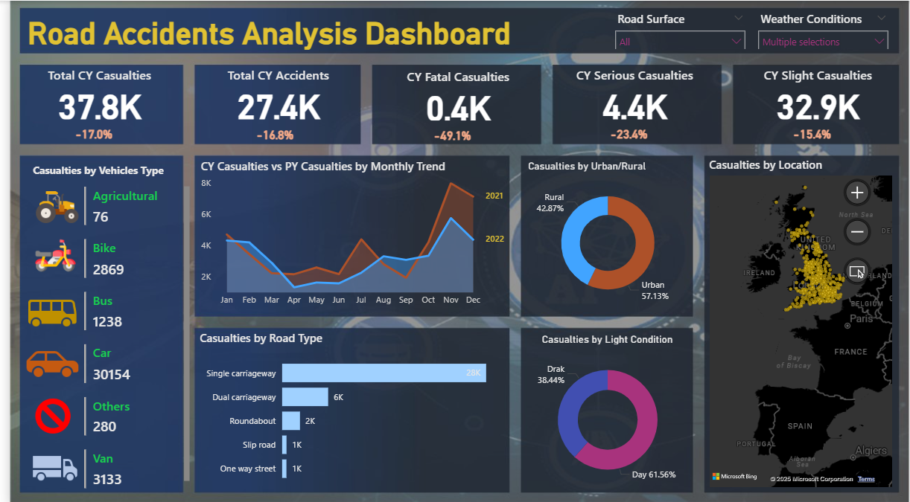

# ROAD ACCIDENT Analysis Dashboard
🚦 Road Accidents Analysis Dashboard
📊 Overview

This Power BI dashboard provides an interactive and comprehensive analysis of road accidents across different regions. It enables users to explore accident trends, casualty severity, vehicle types, and environmental conditions that contribute to road accidents.

The goal of this project is to identify key insights and patterns in road accident data to support data-driven decision-making for road safety improvements.

🧩 Key Insights

Total Casualties (Current Year): 37.8K — showing a 17% decrease compared to the previous year.

Total Accidents (Current Year): 27.4K — a 16.8% reduction year-over-year.

Fatal Casualties: 0.4K (−49.1%)

Serious Casualties: 4.4K (−23.4%)

Slight Casualties: 32.9K (−15.4%)

📈 Dashboard Highlights

Casualties by Vehicle Type: Breakdown across cars, bikes, buses, vans, agricultural vehicles, and others.

Monthly Casualty Trends: Comparative line chart showing current vs previous year patterns.

Casualties by Road Type: Analysis of single carriageways, dual carriageways, roundabouts, slip roads, and one-way streets.

Urban vs Rural Distribution: Pie chart comparing accident proportions in urban (57%) vs rural (43%) areas.

Light Conditions: Insights into accidents during day (61%) vs dark (38%) conditions.

Geographical Map: Interactive location-based visualization showing accident density across the UK.

🧮 Tools & Technologies

Power BI Desktop – Data visualization and dashboard creation

Microsoft Excel / CSV Dataset – Source data for analysis

This repository contains the Power BI `.pbix` file for the IPL Dashboard.
